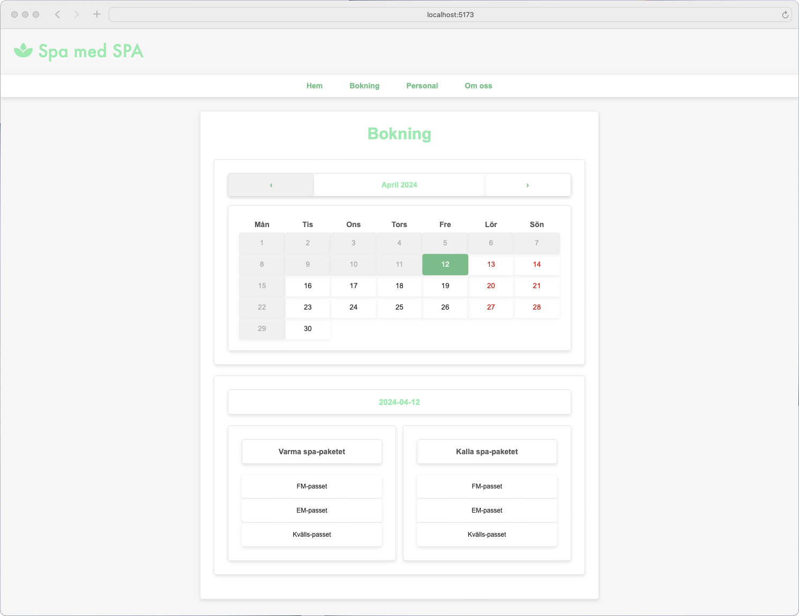

# spa-med-spa

### 1. Ladda ner [spa-med-spa](https://github.com/RobbanT/spa-med-spa/archive/refs/heads/main.zip).

### 2. Öppna upp projektet i Visual Studio Code.

### 3. Skriv sedan "npm install" följt av "npm dev run"i terminalen.

### 4. Öppna sedan upp länken i terminalen med din webbläsare. Sen är det fritt fram att testa hur allt fungerar.
